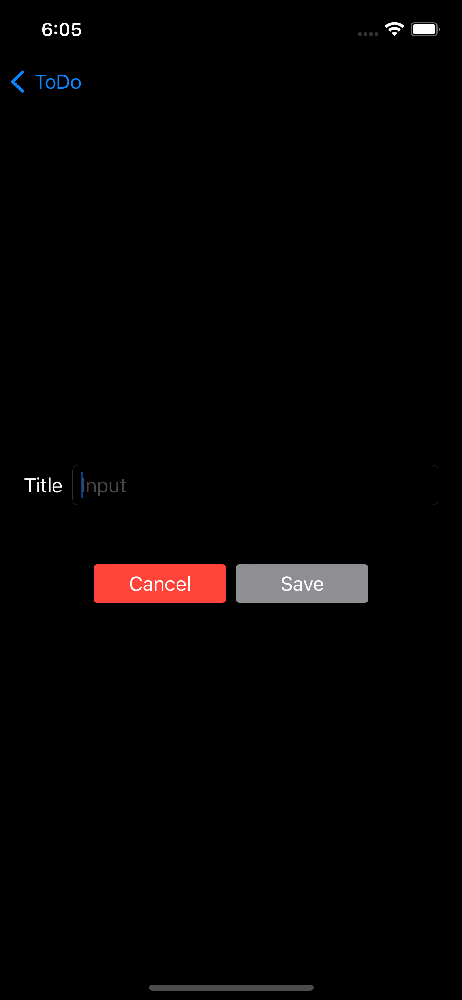

# iOS TDD Flow
- Fully understand the user stories that PO provides
- Analyze business tasking: Seperate several business tasking from the user story, describing using the format of Given-When-Then
- Analyze technical tasking: describe every business tasking regarding its three layers as ViewModel, View, and Model. Logically reflect the inner implemetation of each class to business tasking. Analyze the relationaship and interaction among ViewModel, View, and Model, found out the input and output of each class aligning with business tasking, regardless of detailed implemetation of each class.
- write test cases regarding tech tasking

# Sample
## UserStory: As a user, I want to uncheck a to-do item
### Business tasking: Given: there exist finished item; When: user click uncheck button; Then: the item will be removed from finished section, and be inserted to the last of todo section.
tech tasking:
- ViewModel: calling uncheck function in TodoListViewModel, the finished item is removed from finished array.
- View: user located at ToDOListView page and clicked uncheck button of one of the finished item, execute the uncheck function inside TodoListViewModel. 
- Model：TodoItem model

# List

## User Stories

### As a user, I want to see all the checked items below the unchecked items
#### Given: have todo items and finished items at the same time, Then: todo items display at the top section, finished items display at the bottom section.
- ViewModel：neither todoItems array nor finishedItems array is empty in the ViewModel
- View：user located at the items listing view, observe that the todo section show up at top and obtain items, finished section show up at bottom and obtain items
- Model：TodoItem model
#### Given: only have todo items, Then: only display todo section, there is no finished section display nor its headline.
- ViewModel：todoItems array is not empty, finishedItems array is empty in the ViewModel
- View：user located at the item listing view, observe that todo section show up and obtain items
- Model：TodoItem model
#### Given: only have finished items, Then: only display finished section, there is no todo section display nor its headline.
- ViewModel：todoItems array is empty, finishedItems array is not empty in the ViewModel
- View：user located at the item listing view, observe that finished section show up and obtain items
- Model：TodoItem model
#### Given: have neither todo section nor finished section, Then: display blank page
- ViewModel：both todoItems array and finishedItems array are empty in the ViewModel
- View：user located at the item listing view, observe blank page
- Model：TodoItem model

### As a user, I want to check a to-do item to mark it as finished
#### Given: there exist todo item, When: user click its check button, Then: the item will be removed from todo section, and be inserted to the first of finished section.
- ViewModel：calling check function in the ViewwModel, the todo item is removed from todoItems array
- View：user click check button, calling the check function in the ViewModel
- Model：TodoItem model

### As a user, I want to uncheck a to-do item
#### Given: there exist finished item, When: user click its uncheck button, Then: the item will be removed from finished section, and be inserted to the last of todo section.
- ViewModel：calling uncheck function in the ViewwModel, the finished item is removed from finishedItems array
- View：user click uncheck button, calling the uncheck function in the ViewModel
- Model：TodoItem model

### As a user, I want to delete a to-do or finished item
#### Given: there exist todo item, When: user click its delete button, Then: todo item willbe removed from todo section.
- ViewModel：calling delete function in the ViewwModel, the todo item is removed from todoItems array
- View：user click delete button, calling the delete function in the ViewModel
- Model：TodoItem model

#### Given: there exist finished item, When: user click its delete button, Then: finished item will be removed from finished section.
- ViewModel：calling delete function in the ViewwModel, the finished item is removed from finishedItems array
- View：user click delete button, calling the delete function in the ViewModel
- Model：TodoItem model

### users' action of adding/updating items can be restore in the local environment, the restored items can be displayed in the item list when reboost the app.
#### when: add a new item, Then: it can be restored in the local environment and display in the item list when reboost the app.
- ViewModel：when adding new item, calling save function of storage to restore the item.
- Model：TodoItem model

#### when: update an item, Then: its modification can be restored in the local environment, the updated state can be displayed in the item list when reboost the app.
- ViewModel：when updating an item, calling update function of storage to update the item
- Model：TodoItem model

#### when: deleting an item,Then: this item can be deleted in the local environment, it will not displayed in the item list when reboost the app.
- ViewModel：when deleting an item, calling delete function of storage to delete the item
- Model：TodoItem model

# Detail

## User Stories

### As a user, given that I have tapped a to-do or finished item in the list, I want to goback by click back button in the navigator
#### Given: user landing at the item detail page, When: click the back button at the top left corner Then: will direct back to the item listing page.

### As a user, given that I have tapped a to-do item in the list, I want to see its details
#### Given: there exist todo items in the item list, When: user click a todo item Then: will direct to its item detail page.
#### Given: user landing at the todo item detail page, Then: item detail page will display title of the item, and the check button at the bottom.

### As a user, I want to check a to-do item from its details view
#### Given user landing at the todo item detail page, When: click the check button, Then: the check button will turns to uncheck. When back to item listing page, the item has already been removed from todo section, and inserted as the first of finished section.

### As a user, given that I have tapped a finshed item in the list, I want to see its details
#### Given: there exist finished items in the item list, When: user click a finished item, Then: will direct to its item detail page.
#### Given: user landing at the todo item detail page, Then: item detail page will display title of the item, and the uncheck button at the bottom.

### As a user, I want to uncheck a finished item from its details view
#### Given: user landing at the finished item detail page, When: click the uncheck button, Then: the uncheck button will turns to check. When back to item listing page, the item has already been removed from finished section, and inserted as the last of todo section.

# Add

## User Stories
### **UserStory1:** As a user, given that I have tapped the add (+) button in the item list, I want to see a form to put in the details (title) of a to-do item
#### **AC1:** Given: user landing at the list page, when: user click + button at the top right corner in the item listing page, Then: will direct to input page.
#### **AC2:** Given: user landing at the input page, Then: observe a title textfield at the top and cancel button, save button at the bottom.

### **UserStory2:** As a user, I want to add a to-do item to the list of to-do items by inputting title then tapping on the Save button
#### **AC1:** Given: user landing at the input page, When: click the cancel button Then: will direct back to item listing page, and there will be no new item added.
#### **AC2:** Given: user landing at the input page, When: there is no input in the title textfield, Then: the save button is unclickable and has gray color.
- ViewModel：calling updateButtonState function in the ViewModel and set property buttonState to disabled when the title textfield is empty
- View：user delete all input in the title textfield
- Model：TodoItem model
#### **AC3:** Given: user landing at the input page, When: there is input in the title textfield, Then: the save button is clickable and has green color.
- ViewModel：calling updateButtonState function in the ViewModel and set property buttonState to enabled when the title textfield has text
- View：user type in input in the title textfield
- Model：TodoItem model
#### **AC4:** Given: user landing at the input page, When: there is input in the title textfield, click save button, Then: will direct to item listing page and the new item has been inserted to the first of todo section.
- ViewModel：calling save function in the ViewModel, the todo item is restored in the local environment
- View：user type in input in the title textfield, click save button, calling the save function in the ViewModel
- Model：TodoItem model