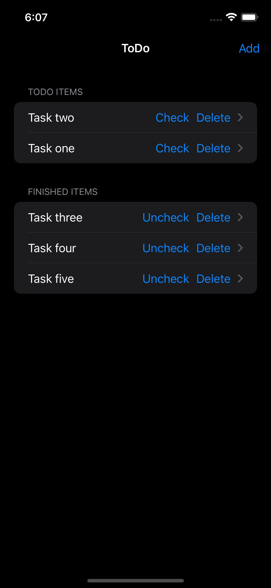

# iOS TDD流程
- 理解PO提供的User Story
- 梳理业务tasking：从User Story中拆分出若干个业务tasking，每条业务tasking以Given-When-Then的格式描述
- 梳理技术tasking：分别从ViewModel、View、Model三个层级去描述每条业务tasking，每个类内部的描述需要和业务Tasking进行逻辑映射。把ViewModel、View、Model交互关系梳理出来，以及对应着业务tasking梳理出每个类输入和输出，不需要关心每个类内部的具体实现。
- 针对技术tasking写出testcase

# 示例
## UserStory: As a user, I want to uncheck a to-do item
### 业务Tasking：Given：有finished item；When：用户点击uncheck button；Then：该item会从finished section移除，且会被添加到todo section的最后一个位置。
技术Tasking：
- ViewModel：TodoListViewModel的uncheck方法被调用，对应的finished item从finishedItems array中被移除。
- View：用户在ToDoListView页面点击某个finshed item view里面的uncheck按钮，调用TodoListViewModel的uncheck方法。
- Model：TodoItem结构体

# 任务
- 按照示例，给每一个UserStory按照Given-When-Then的格式梳理出业务Tasking；
- 针对每一个业务Tasking，根据ViewModel、View、Model三个层级去描述他们之间的交互关系；
- 针对每一个技术Tasking，如果是逻辑相关的使用Unit Tests驱动开发。如果是UI相关的使用UI Tests驱动开发；

# List

## User Stories

### As a user, I want to see all the checked items below the unchecked items

### As a user, I want to check a to-do item to mark it as finished

### As a user, I want to uncheck a to-do item

### As a user, I want to delete a to-do or finished item

# Detail

## User Stories

### As a user, given that I have tapped a to-do or finished item in the list, I want to goback by click back button in the navigator

### As a user, given that I have tapped a to-do item in the list, I want to see its details

### As a user, I want to check a to-do item from its details view

### As a user, given that I have tapped a finshed item in the list, I want to see its details

### As a user, I want to uncheck a finished item from its details view

# Add

## User Stories
### As a user, given that I have tapped the add (+) button in the item list, I want to see a form to put in the details (title) of a to-do item

### As a user, I want to add a to-do item to the list of to-do items by inputting title then tapping on the Save button
