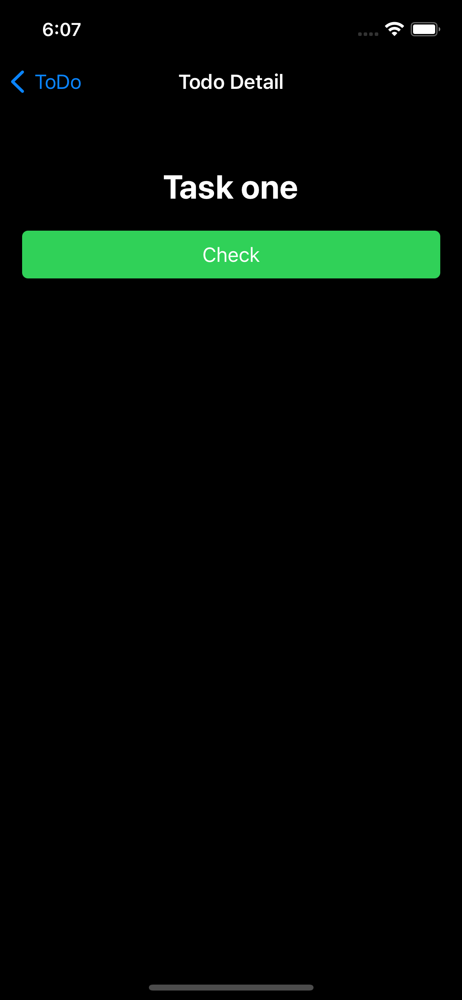

# iOS TDD流程
- 理解PO提供的User Story
- 梳理业务tasking：从User Story中拆分出若干个业务tasking，每条业务tasking以Given-When-Then的格式描述
- 梳理技术tasking：分别从ViewModel、View、Model三个层级去描述每条业务tasking，每个类内部的描述需要和业务Tasking进行逻辑映射。把ViewModel、View、Model交互关系梳理出来，以及对应着业务tasking梳理出每个类输入和输出，不需要关心每个类内部的具体实现。
- 针对技术tasking写出testcase

# 示例
## UserStory: As a user, I want to uncheck a to-do item
### 业务tasking：Given：有finished item；When：用户点击uncheck button；Then：该item会从finished section移除，且会被添加到todo section的最后一个位置。
技术tasking：
- ViewModel：TodoListViewModel的uncheck方法被调用，对应的finished item从finishedItems array中被移除。
- View：用户在ToDoListView页面点击某个finshed item view里面的uncheck按钮，调用TodoListViewModel的uncheck方法。
- Model：TodoItem model

# List

## User Stories

### As a user, I want to see all the checked items below the unchecked items
#### 同时有todo和finished items，todo items显示在第一个section，finshed items显示到最后一个section。
- ViewModel：ViewModel的todoItems array和finishedItems array 都不为空
- View：用户在事件列表页面，看到todo section显示在上面且有items，finished section显示在下面且有items
- Model：TodoItem model
#### 只有todo items时，只显示todo section，不显示finished section，包含header title。
- ViewModel：ViewModel的todoItems array不为空，且finishedItems array 为空
- View：用户在事件列表页面，看到todo section显示且有items
- Model：TodoItem model
#### 只有finished items时，只显示finished section，不显示todo section，包含header title。
- ViewModel：ViewModel的todoItems array为空，且finishedItems array 不为空
- View：用户在事件列表页面，看到finished section显示且有items
- Model：TodoItem model
#### 都没有时，显示空白页面
- ViewModel：ViewModel的todoItems array和finishedItems array 为空
- View：用户在事件列表页面，看到空白页面
- Model：TodoItem model

### As a user, I want to check a to-do item to mark it as finished
#### 有todo item，用户点击check button，该item会从todo section被移除，然后被添加到finished section的第一个位置。
- ViewModel：ViewModel的check方法被调用，对应的todo item从todo items array中被移除。
- View：用户点击check按钮，调用ViewModel的check方法。
- Model：TodoItem model 

### As a user, I want to uncheck a to-do item
#### 有finished item，用户点击uncheck button，该item会从finished section移除，且会被添加到todo section的最后一个位置。
- ViewModel：ViewModel的uncheck方法被调用，对应的finished item从finished items array中被移除。
- View：用户点击uncheck按钮，调用ViewModel的uncheck方法。
- Model：TodoItem model

### As a user, I want to delete a to-do or finished item
#### 有todo tem，用户点击delete button，todo item从todo section中被移除。
- ViewModel：ViewModel的deletek方法被调用，对应的todo item从todo items array中被移除。
- View：用户点击todo item的delete按钮，调用ViewModel的delete方法。
- Model：TodoItem model

#### 有finished item，用户点击delete button，item从finished section中被移除。
- ViewModel：ViewModel的delete方法被调用，对应的finished item从finished items array中被移除。
- View：用户点击finished item的delete按钮，调用ViewModel的delete方法。
- Model：TodoItem model

### 用户添加了item或者修改了item内容，可以保存到本地，并在下一次App启动的时候再list中看到已经保存的item
#### 添加了item之后，可以保存到本地，下次启动的时候可以看到这条item
- ViewModel：添加item时，调用storage的save接口来保存item
- Model：TodoItem model

#### 当修改了item之后，该item的修改会同步到本地，下次启动的时候看到最新的状态
- ViewModel：更新item时，调用storage的update接口来更新item
- Model：TodoItem model

#### 当删除了item之后，该item也会从本地中删除，下次启动的时候不会看到该item
- ViewModel：删除item时，调用storage的delete接口来删除item
- Model：TodoItem model

# Detail

## User Stories

### As a user, given that I have tapped a to-do or finished item in the list, I want to goback by click back button in the navigator
#### 当用户在item detail页面，点击左上角back按钮，返回到上一个列表页面。

### As a user, given that I have tapped a to-do item in the list, I want to see its details
#### 当列表有todo item时，用户点击todo item，然后进去该item的detail页面。
#### detail页面显示item的title，并且底部显示check button

### As a user, I want to check a to-do item from its details view
#### 当用户在todo item detail页面，用户点击check按钮，check按钮更改为uncheck。回到列表时，该item已经被todo secton移除，且被添加到finished section的第一个位置。

### As a user, given that I have tapped a finshed item in the list, I want to see its details
#### 当列表有finshed item时，用户点击finished item，然后进去该item的detail页面。
#### detail页面显示item的title，并且底部显示uncheck button

### As a user, I want to uncheck a finished item from its details view
#### 当用户在finished item detail页面，用户点击uncheck按钮，uncheck按钮更改为check。回到列表时，该item已经被finished todo section的最后一个位置。

# Add

## User Stories
### As a user, given that I have tapped the add (+) button in the item list, I want to see a form to put in the details (title) of a to-do item
#### 当用户点击在列表页面右上角的+按钮，然后显示input页面。
#### 当用户在input页面时，页面在顶部显示一个title 输入框，在底部显示cancel和save button。

### As a user, I want to add a to-do item to the list of to-do items by inputting title then tapping on the Save button
#### 当用户在input页面时，点击了cancel按钮，返回到列表页面，且列表页面不会有新增item。
#### 当用户在input页面时，且title输入框没有任何内容，save按钮不可点击且背景色变为灰色。
#### 当用户在input页面时，且titel输入框有键入内容，save按钮可以点击其背景色变为绿色
#### 当用户在input页面时，且titel输入框有键入内容；用户点击save按钮，返回到列表页面，且该item插入到todo section的第一个位置。
- ViewModel：ViewModel的save方法被调用，对应的todo item在本地被存储。
- View：用户在输入框键入内容，点击save button，调用ViewModel的save方法。
- Model：TodoItem model
